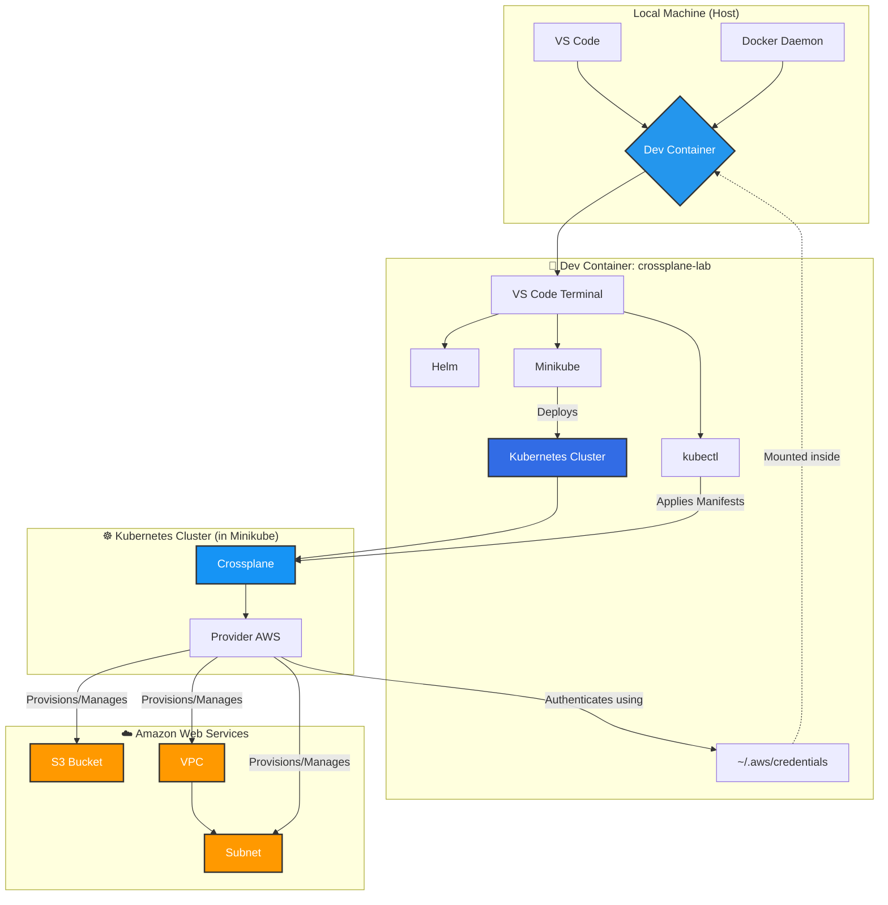

# Crossplane Lab with Dev Containers 🚀

This hands-on lab will teach you the fundamentals of **Crossplane**, an open-source control plane tool that allows you to manage cloud infrastructure and services directly from the Kubernetes API. Everything will run in a containerized development environment (*Dev Container*) to ensure a clean, reproducible, and isolated experience.

---

## 📋 Main Objective

Provision, manage, and delete an S3 bucket, a VPC, and a Subnet in AWS using Kubernetes manifests.

---

## 🏗️ Architecture Diagram



---

## 📂 Project Structure

The file structure is designed to be modular and clear:

```
crossplane-lab/
├── .devcontainer/
│   ├── crossplane-lab.code-workspace   # VS Code workspace configuration
│   ├── devcontainer.json              # Dev Container configuration
│   ├── docker-compose.yml             # Docker Compose file for the environment
│   ├── Dockerfile                     # Dockerfile for building the container
├── crossplane/
│   ├── AWS-resources/
│   │   ├── s3-bucket.yaml             # Manifest for provisioning the S3 bucket
│   │   ├── subnet.yaml                # Manifest for provisioning the Subnet
│   │   ├── vpc.yaml                   # Manifest for provisioning the VPC
│   ├── Config-crossplane/
│   │   ├── provider-aws.yaml          # Manifest for installing the AWS Provider
│   │   ├── provider-config-aws.yaml   # Configuration for authenticating the AWS Provider
├── README.md                          # Documentation for the lab
├── .gitignore                         # Git ignore file
```

---

## 🚀 Step-by-Step Implementation Guide

### ✅ Step 0: Prerequisites on Your Host Machine

1. **Docker Desktop** installed and running.
2. **Visual Studio Code** with the *Remote - Containers* extension.
3. **AWS credentials** configured locally:
   ```bash
   aws configure
   ```
   Ensure your `~/.aws/credentials` file is properly set up.

---

### 🛠️ Step 1: Start the Environment and Configure Credentials

1. **Open the Project**: Open this folder in VS Code.
2. **Launch the Dev Container**: Click "Reopen in Container."
3. **Configure AWS CLI inside the Container**:
   ```bash
   aws configure
   ```
   Enter your Access Key ID and Secret Access Key.

---

### ☸️ Step 2: Prepare the Kubernetes Cluster

1. **Start Minikube**:
   ```bash
   minikube start
   ```
   This will automatically configure `kubectl` to point to the new cluster.

2. **Verify the connection**:
   ```bash
   kubectl get nodes
   ```
   Wait for the `STATUS` to change to `Ready`.

---

### 🧩 Step 3: Install and Configure Crossplane

1. **Add the Helm repository**:
   ```bash
   helm repo add crossplane-stable https://charts.crossplane.io/stable
   helm repo update
   ```

2. **Install Crossplane**:
   ```bash
   helm install crossplane --namespace crossplane-system --create-namespace crossplane-stable/crossplane
   ```

3. **Verify Crossplane Pods**:
   ```bash
   kubectl get pods -n crossplane-system -w
   ```

4. **Install the AWS Provider**:
   ```bash
   kubectl apply -f crossplane/provider-aws.yaml
   ```

5. **Wait for the Provider to be healthy**:
   ```bash
   kubectl get provider.pkg.crossplane.io -w
   ```

6. **Create the Kubernetes Secret for AWS Credentials**:
   ```bash
   kubectl create secret generic aws-secret -n crossplane-system --from-file=creds=/home/arheanja/.aws/credentials
   ```

7. **Apply the Provider Configuration**:
   ```bash
   kubectl apply -f crossplane/provider-config-aws.yaml
   ```

---

### 🪣 Step 4: Provision the S3 Bucket

1. **Edit the `s3-bucket.yaml` manifest**:
   Ensure the bucket name is globally unique:
   ```yaml
   metadata:
     name: my-unique-crossplane-bucket-jaime-20250616
   ```

2. **Apply the manifest**:
   ```bash
   kubectl apply -f crossplane/s3-bucket.yaml
   ```

3. **Check the Bucket resource status**:
   ```bash
   kubectl get bucket -w
   ```

4. **Confirm in the AWS Console**: Log in to your AWS account and verify the bucket exists.

---

### 🌐 Step 5: Expand with a VPC and Subnet

1. **Create and apply the `vpc.yaml` manifest**:
   ```bash
   kubectl apply -f crossplane/vpc.yaml
   ```

2. **Create and apply the `subnet.yaml` manifest**:
   ```bash
   kubectl apply -f crossplane/subnet.yaml
   ```

3. **Verify the resources**:
   ```bash
   kubectl get vpc
   kubectl get subnet
   ```

4. **Confirm in the AWS Console**: Verify the resources in the VPC service.

---

### 🧹 Step 6: Clean Up Resources

1. **Delete the Subnet**:
   ```bash
   kubectl delete -f crossplane/subnet.yaml
   ```

2. **Delete the VPC**:
   ```bash
   kubectl delete -f crossplane/vpc.yaml
   ```

3. **Delete the S3 Bucket**:
   ```bash
   kubectl delete -f crossplane/s3-bucket.yaml
   ```

4. **Stop Minikube**:
   ```bash
   minikube stop
   ```

5. **Close the Dev Container**: Click the green button in the bottom-left corner of VS Code and select "Close Remote Connection."

---

## 📝 Final Notes

This lab is designed to be reproducible and isolated, ensuring you can experiment with Crossplane without affecting your local machine. Enjoy learning and creating cloud infrastructure with Kubernetes and Crossplane!

---

**Jaime A. Henao
Devops