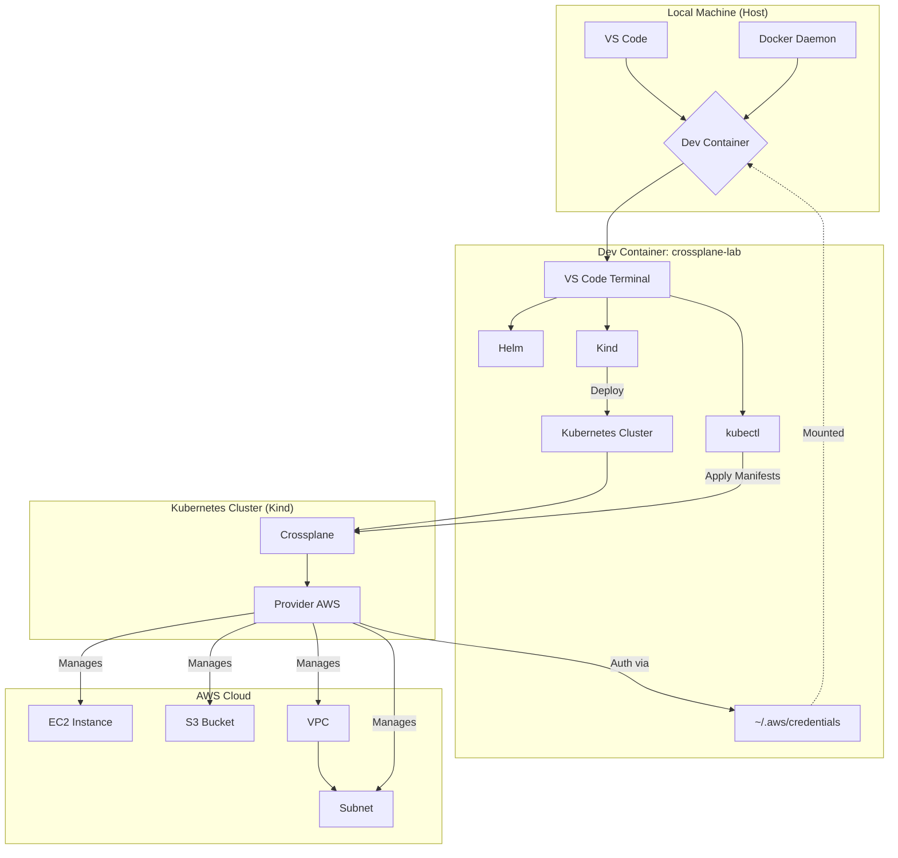

# Crossplane Lab with Dev Containers

This lab demonstrates how to manage AWS infrastructure (EC2 instance, S3 bucket, VPC, and Subnet) using Crossplane directly from Kubernetes manifests. The dev container setup provides an isolated, reproducible environment.

---

## Main Objective
• Provision, manage, and remove AWS services (EC2, S3, VPC, Subnet) using Kubernetes manifests.

---

## Architecture Diagram



---

## Project Structure

```
crossplane-lab/
├── .devcontainer/
│   ├── crossplane-lab.code-workspace
│   ├── devcontainer.json
│   ├── docker-compose.yml
│   └── Dockerfile
├── crossplane/
│   ├── AWS-resources/
│   │   ├── ec2-instance.yaml
│   │   ├── s3-bucket.yaml
│   │   ├── subnet.yaml
│   │   └── vpc.yaml
│   ├── Config-crossplane/
│   │   ├── provider-aws.yaml
│   │   └── provider-config-aws.yaml
├── README.md
├── .gitignore
├── .env
├── create-key-par.sh
└── Makefile
```

---

## Setup Steps

### 1. Prerequisites  
• Docker Desktop running.  
• VS Code with the Remote - Containers extension.  
• AWS credentials set up locally with `aws configure`.

### 2. Start Environment and Configure Credentials  
1. Open this folder in VS Code.  
2. Select “Reopen in Container” to launch the dev container.  
3. Inside the container, configure AWS:  
   ```bash
   aws configure
   ```

### 3. Prepare Kubernetes Cluster  
1. Create a Kind cluster:  
   ```bash
   make cluster
   ```  
2. Check nodes:  
   ```bash
   kubectl get nodes
   ```

### 4. Install Crossplane and Configure AWS  
1. Install Crossplane:  
   ```bash
   make install-crossplane
   ```  
2. Create AWS secret:  
   ```bash
   make setup-aws
   ```  
3. Apply provider manifests:  
   ```bash
   make apply-resources
   ```

### 5. Create Key Pair and Apply EC2  
1. Generate key pair:  
   ```bash
   make create-keypair
   ```  
2. Apply the EC2 manifest:  
   ```bash
   make apply-ec2
   ```

### 6. Optional: Provision Other AWS Resources  
```bash
kubectl apply -f crossplane/AWS-resources/s3-bucket.yaml
kubectl apply -f crossplane/AWS-resources/vpc.yaml
kubectl apply -f crossplane/AWS-resources/subnet.yaml
```

### 7. Clean Up  
1. Remove resources individually:  
   ```bash
   kubectl delete -f crossplane/AWS-resources/<resource-file>.yaml
   ```  
2. Remove the cluster:  
   ```bash
   make clean
   ```

---

## Final Notes
This lab is designed to be fully reproducible and isolated so you can explore Crossplane without impacting your local setup. If any issues arise, check the Crossplane pod logs:

```bash
kubectl logs -n crossplane-system <pod-name>
```

Enjoy learning about infrastructure management with Kubernetes and Crossplane!
