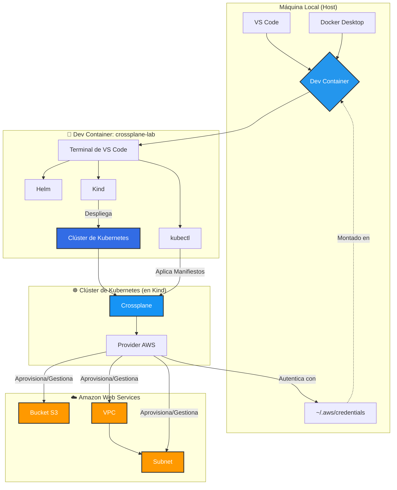

# Laboratorio Crossplane con Dev Containers 🚀

Este laboratorio práctico te enseñará los fundamentos de **Crossplane**, una herramienta de plano de control de código abierto que permite gestionar infraestructura y servicios en la nube directamente desde la API de Kubernetes. Todo se ejecutará en un entorno de desarrollo en contenedor (*Dev Container*) para garantizar una experiencia limpia, reproducible y aislada.

---

## 📋 Objetivo Principal

Aprovisionar, gestionar y eliminar un bucket S3, una VPC y una Subnet en AWS utilizando manifiestos de Kubernetes.

---

## 🏗️ Diagrama de Arquitectura



---

## 📂 Estructura del Proyecto

La estructura de archivos está diseñada para ser modular y clara:

```
crossplane-lab/
├── .devcontainer/
│   ├── devcontainer.json       # 🧠 Configuración del entorno Dev Container.
│   ├── docker-compose.yml      # 🏗️ Define servicios y volúmenes.
│   ├── Dockerfile              # 📦 Construye la imagen base con herramientas necesarias.
├── crossplane/
│   ├── provider-aws.yaml       # Manifiesto para instalar el Provider de AWS.
│   ├── provider-config-aws.yaml# Configuración de autenticación del Provider.
│   ├── s3-bucket.yaml          # Manifiesto para aprovisionar el bucket S3.
│   ├── vpc.yaml                # Manifiesto para aprovisionar la VPC.
│   ├── subnet.yaml             # Manifiesto para aprovisionar la Subnet.
└── README.md                   # 📖 Documentación del laboratorio.
```

---

## 🚀 Guía de Implementación Paso a Paso

### ✅ Paso 0: Prerrequisitos en tu Máquina Host

1. **Docker Desktop** instalado y en ejecución.
2. **Visual Studio Code** con la extensión *Remote - Containers*.
3. **Credenciales de AWS** configuradas localmente:
   ```bash
   aws configure
   ```
   Asegúrate de tener tu archivo `~/.aws/credentials` configurado.

---

### 🛠️ Paso 1: Iniciar el Entorno y Configurar Credenciales

1. **Abrir el Proyecto**: Abre esta carpeta en VS Code.
2. **Lanzar el Dev Container**: Haz clic en "Reopen in Container".
3. **Configurar AWS CLI dentro del Contenedor**:
   ```bash
   aws configure
   ```
   Introduce tu Access Key ID y Secret Access Key.

---

### ☸️ Paso 2: Preparación del Clúster de Kubernetes

1. **Crear el clúster con Kind**:
   ```bash
   kind create cluster --name crossplane-lab
   ```
   Esto configurará automáticamente `kubectl` para apuntar al nuevo clúster.

2. **Verificar la conexión**:
   ```bash
   kubectl get nodes
   ```
   Espera a que el `STATUS` cambie a `Ready`.

---

### 🧩 Paso 3: Instalación y Configuración de Crossplane

1. **Añadir el repositorio de Helm**:
   ```bash
   helm repo add crossplane-stable https://charts.crossplane.io/stable
   helm repo update
   ```

2. **Instalar Crossplane**:
   ```bash
   helm install crossplane --namespace crossplane-system --create-namespace crossplane-stable/crossplane
   ```

3. **Verificar los Pods de Crossplane**:
   ```bash
   kubectl get pods -n crossplane-system -w
   ```

4. **Instalar el Provider de AWS**:
   ```bash
   kubectl apply -f crossplane/provider-aws.yaml
   ```

5. **Esperar a que el Provider esté saludable**:
   ```bash
   kubectl get provider.pkg.crossplane.io -w
   ```

6. **Crear el Secreto de Kubernetes para las Credenciales**:
   ```bash
   kubectl create secret generic aws-secret -n crossplane-system --from-file=creds=/home/arheanja/.aws/credentials
   ```

7. **Aplicar la Configuración del Provider**:
   ```bash
   kubectl apply -f crossplane/provider-config-aws.yaml
   ```

---

### 🪣 Paso 4: Aprovisionamiento del Bucket S3

1. **Editar el manifiesto `s3-bucket.yaml`**:
   Asegúrate de que el nombre del bucket sea único globalmente:
   ```yaml
   metadata:
     name: mi-bucket-unico-crossplane-jaime-20250616
   ```

2. **Aplicar el manifiesto**:
   ```bash
   kubectl apply -f crossplane/s3-bucket.yaml
   ```

3. **Verificar el estado del recurso Bucket**:
   ```bash
   kubectl get bucket -w
   ```

4. **Confirmar en la Consola de AWS**: Inicia sesión en tu cuenta de AWS y verifica que el bucket existe.

---

### 🌐 Paso 5: Expandiendo con una VPC y Subnet

1. **Crear y aplicar el manifiesto `vpc.yaml`**:
   ```bash
   kubectl apply -f crossplane/vpc.yaml
   ```

2. **Crear y aplicar el manifiesto `subnet.yaml`**:
   ```bash
   kubectl apply -f crossplane/subnet.yaml
   ```

3. **Verificar los recursos**:
   ```bash
   kubectl get vpc
   kubectl get subnet
   ```

4. **Confirmar en la Consola de AWS**: Verifica los recursos en el servicio VPC.

---

### 🧹 Paso 6: Limpieza de Recursos

1. **Eliminar la Subnet**:
   ```bash
   kubectl delete -f crossplane/subnet.yaml
   ```

2. **Eliminar la VPC**:
   ```bash
   kubectl delete -f crossplane/vpc.yaml
   ```

3. **Eliminar el bucket S3**:
   ```bash
   kubectl delete -f crossplane/s3-bucket.yaml
   ```

4. **Eliminar el clúster de Kind**:
   ```bash
   kind delete cluster --name crossplane-lab
   ```

5. **Cerrar el Dev Container**: Haz clic en el botón verde en la esquina inferior izquierda de VS Code y selecciona "Close Remote Connection".

---

## 📝 Notas Finales

Este laboratorio está diseñado para ser reproducible y aislado, garantizando que puedas experimentar con Crossplane sin afectar tu máquina local. ¡Disfruta aprendiendo y creando infraestructura en la nube con Kubernetes y Crossplane!